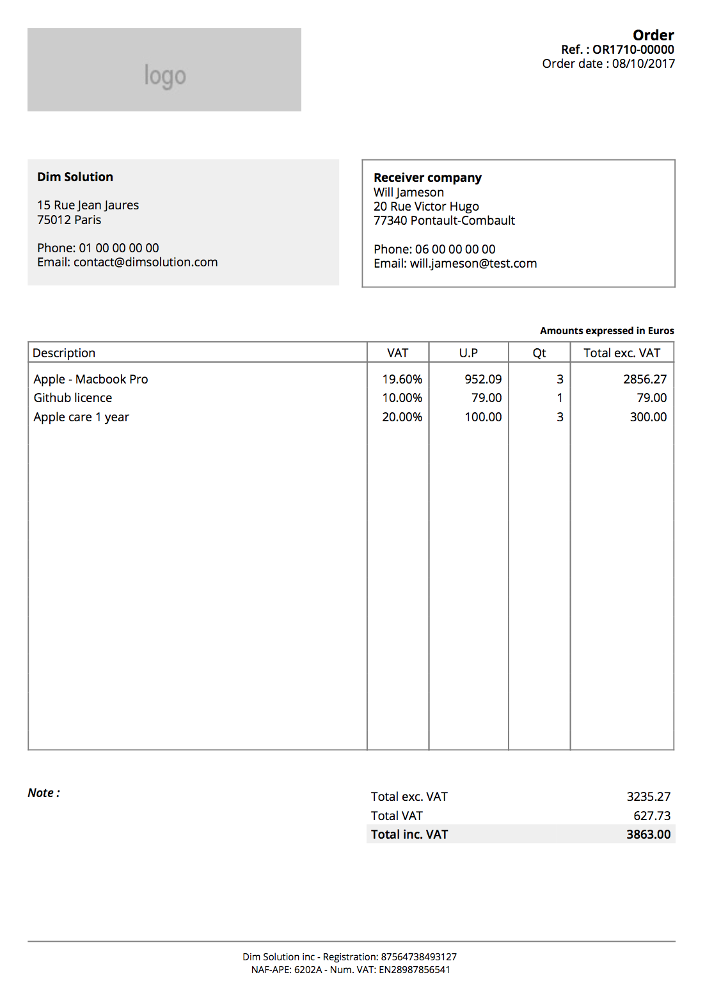

# invoice-it

[![Dependencies][prod-dependencies-badge]][prod-dependencies]
[![Dependencies][dev-dependencies-badge]][dev-dependencies]
[![Code Climate score][codeclimate-score-badge]][codeclimate-score]
[![Code Climate coverage][codeclimate-coverage-badge]][codeclimate-coverage]
[![Code Climate coverage][codeclimate-issues-badge]][codeclimate-issues]
[![Node.js version][nodejs-badge]][nodejs]
[![NPM version][npm-badge]][npm]
[![Build Status][travis-badge]][travis-ci]
[![MIT License][license-badge]][LICENSE]
[![PRs Welcome][prs-badge]][prs]

Generate your orders and you invoices and export them easily.
If you want some examples, check tests.

## Features

- Generate order / invoice
- Export to HTML / PDF / Stream
- Easy to use it
- Robust implementation with good unit test coverage.

## Demonstration

### Order

[](https://github.com/rimiti/invoice-it/tree/master/static/images/order.png)

### Invoice

[](https://github.com/rimiti/invoice-it/tree/master/static/images/invoice.png)

## Usage

### Order

To generate an order:

```js
import invoiceIt from 'invoice-it';

  const recipient = {
    company_name: 'Receiver company',
    first_name: 'Will',
    last_name: 'Jameson',
    street_number: '20',
    street_name: 'Rue Victor Hugo',
    zip_code: '77340',
    city: 'Pontault-Combault',
    country: 'France',
    phone: '06 00 00 00 00',
    mail: 'will.jameson@test.com'
  };

  const emitter = {
    name: 'Dim Solution',
    street_number: '15',
    street_name: 'Rue Jean Jaures',
    zip_code: '75012',
    city: 'Paris',
    country: 'France',
    phone: '01 00 00 00 00',
    mail: 'contact@dimsolution.com',
    website: 'www.dimsolution.com'
  };

  const order = invoiceIt.create(recipient, emitter);
```

You can also use getter / setters like that

```js
const order = invoiceIt.create();

order.recipient.company_name = 'Receiver company';
order.recipient.first_name = 'Will';
order.recipient.last_name = 'Jameson';
order.recipient.street_number = '20';
order.recipient.street_name = 'Rue Victor Hugo';
order.recipient.zip_code = '77340';
order.recipient.city = 'Pontault-Combault';
order.recipient.country = 'France';
order.recipient.phone = '06 00 00 00 00';
order.recipient.mail = 'will.jameson@test.com';

order.emitter.name = 'Dim Solution';
order.emitter.street_number = '15';
order.emitter.street_name = 'Rue Jean Jaures';
order.emitter.zip_code = '75012';
order.emitter.city = 'Paris';
order.emitter.country = 'France';
order.emitter.phone = '01 00 00 00 00';
order.emitter.mail = 'contact@dimsolution.com';
order.emitter.website = 'www.dimsolution.com';
```

Return order object
```js
order.getOrder();
```

Return html order
```js
order.getOrder().toHTML();
```

Save html order into file (default filepath: 'order.html')
```js
order.getOrder().toHTML().toFile('./order.html')
  .then(() => {
      console.log('HTML file created.');
  });
```

Save html order into file (default filepath: 'order.pdf')
```js
order.getOrder().toPDF().toFile('./order.pdf')
  .then(() => {
     console.log('PDF file created.');
  });
```

### Invoice

To generate an invoice:

```js
import invoiceIt from 'invoice-it';

  const recipient = {
    company_name: 'Receiver company',
    first_name: 'Will',
    last_name: 'Jameson',
    street_number: '20',
    street_name: 'Rue Victor Hugo',
    zip_code: '77340',
    city: 'Pontault-Combault',
    country: 'France',
    phone: '06 00 00 00 00',
    mail: 'will.jameson@test.com'
  };

  const emitter = {
    name: 'Dim Solution',
    street_number: '15',
    street_name: 'Rue Jean Jaures',
    zip_code: '75012',
    city: 'Paris',
    country: 'France',
    phone: '01 00 00 00 00',
    mail: 'contact@dimsolution.com',
    website: 'www.dimsolution.com'
  };

  const invoice = invoiceIt.create(recipient, emitter);
```

You can also use getter / setters like that

```js
const invoice = invoiceIt.create();

invoice.recipient.company_name = 'Receiver company';
invoice.recipient.first_name = 'Will';
invoice.recipient.last_name = 'Jameson';
invoice.recipient.street_number = '20';
invoice.recipient.street_name = 'Rue Victor Hugo';
invoice.recipient.zip_code = '77340';
invoice.recipient.city = 'Pontault-Combault';
invoice.recipient.country = 'France';
invoice.recipient.phone = '06 00 00 00 00';
invoice.recipient.mail = 'will.jameson@test.com';

invoice.emitter.name = 'Dim Solution';
invoice.emitter.street_number = '15';
invoice.emitter.street_name = 'Rue Jean Jaures';
invoice.emitter.zip_code = '75012';
invoice.emitter.city = 'Paris';
invoice.emitter.country = 'France';
invoice.emitter.phone = '01 00 00 00 00';
invoice.emitter.mail = 'contact@dimsolution.com';
invoice.emitter.website = 'www.dimsolution.com';
```

Return invoice object
```js
invoice.getInvoice();
```

Return html invoice
```js
invoice.getInvoice().toHTML();
```

Save html invoice into file (default filepath: 'invoice.html')
```js
invoice.getInvoice().toHTML().toFile('./invoice.html')
  .then(() => {
      console.log('HTML file created.');
  });
```

Save html invoice into file (default filepath: 'invoice.pdf')
```js
invoice.getInvoice().toPDF().toFile('./invoice.pdf')
  .then(() => {
      console.log('PDF file created.');
  });
```

## Scripts

Run using npm run <script> command.

    clean - remove coverage data, Jest cache and transpiled files,
    lint - lint source files and tests,
    test - lint and run tests with coverage,
    test-only - run tests with coverage,
    test:watch - interactive watch mode to automatically re-run tests,
    build - compile source files,
    build:watch - interactive watch mode, compile sources on change.

## License
MIT © [Dimitri DO BAIRRO](https://github.com/rimiti/invoice-it/blob/master/LICENSE)

[prod-dependencies-badge]: https://david-dm.org/rimiti/invoice-it/status.svg
[prod-dependencies]: https://david-dm.org/rimiti/invoice-it
[dev-dependencies-badge]: https://david-dm.org/rimiti/invoice-it/dev-status.svg
[dev-dependencies]: https://david-dm.org/rimiti/invoice-it?type=dev
[codeclimate-score-badge]: https://codeclimate.com/github/rimiti/invoice-it/badges/gpa.svg
[codeclimate-score]: https://codeclimate.com/github/rimiti/invoice-it
[codeclimate-coverage-badge]: https://codeclimate.com/github/rimiti/invoice-it/badges/coverage.svg
[codeclimate-coverage]: https://codeclimate.com/github/rimiti/invoice-it/coverage
[codeclimate-issues-badge]: https://codeclimate.com/github/rimiti/invoice-it/badges/issue_count.svg
[codeclimate-issues]: https://codeclimate.com/github/rimiti/invoice-it
[nodejs-badge]: https://img.shields.io/badge/node->=%206.9.0-blue.svg?style=flat-square
[nodejs]: https://nodejs.org/dist/latest-v6.x/docs/api/
[npm-badge]: https://img.shields.io/badge/npm->=%203.10.8-blue.svg?style=flat-square
[npm]: https://docs.npmjs.com/
[node_acl]: https://github.com/OptimalBits/node_acl
[travis-badge]: https://travis-ci.org/rimiti/invoice-it.svg?branch=master
[travis-ci]: https://travis-ci.org/rimiti/invoice-it
[license-badge]: https://img.shields.io/badge/license-MIT-blue.svg?style=flat-square
[license]: https://github.com/rimiti/invoice-it/blob/master/LICENSE
[prs-badge]: https://img.shields.io/badge/PRs-welcome-brightgreen.svg?style=flat-square
[prs]: http://makeapullrequest.com
